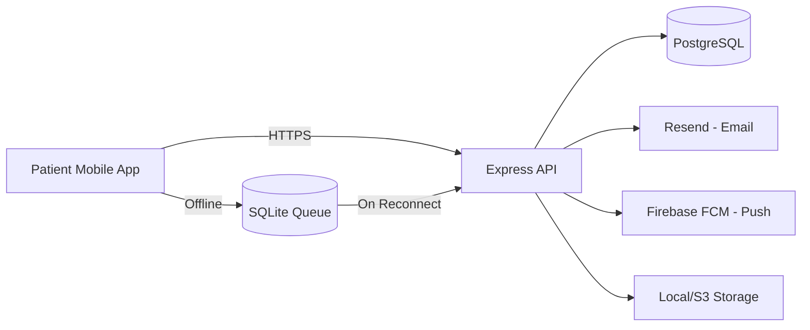
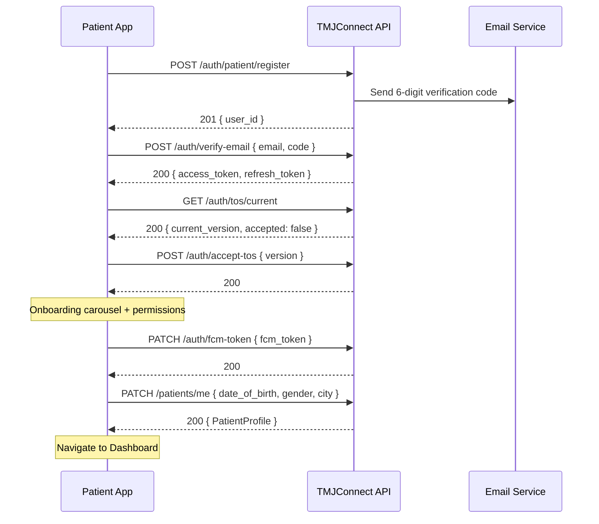
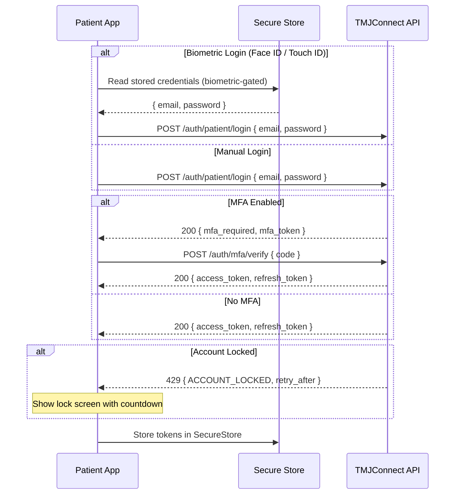
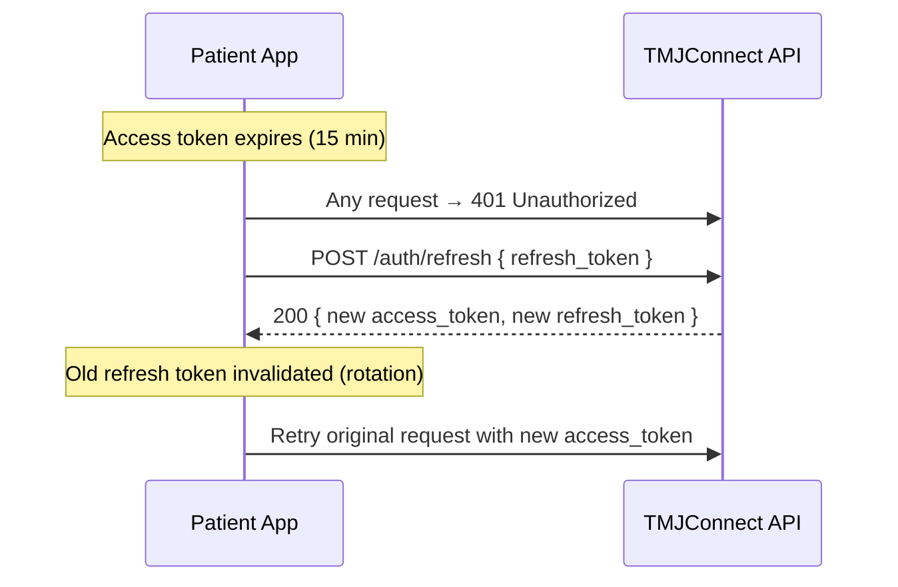
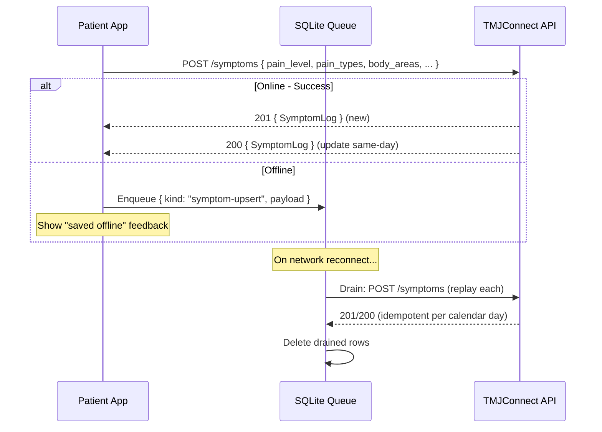
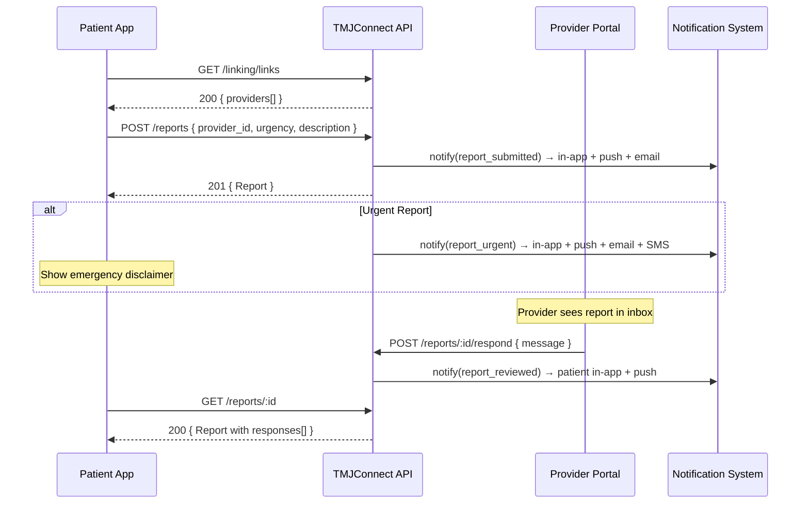
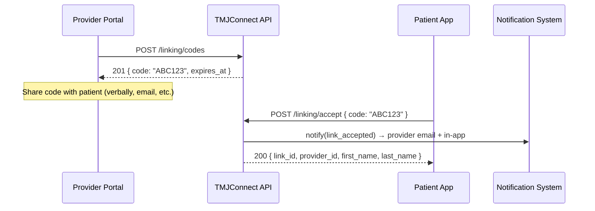
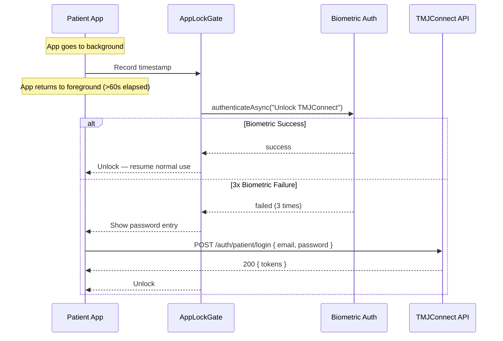

# TMJConnect — Patient App Integration Guide

Sequential API flow for integrating the patient mobile app with the TMJConnect API.

**Base URL:** `/api/v1`
**Auth:** Bearer JWT in `Authorization` header (except public endpoints)

---

## Architecture Overview



## Flow Diagrams

### Complete Registration & Onboarding Flow



### Login Flow (with Optional MFA + Biometric)



### Token Refresh Cycle



### Symptom Logging Flow (with Offline Support)



### Report Submission Flow



### Provider Linking Flow



### App Lock (HIPAA Session Security)



---

## Phase 1: Registration & Onboarding

### Step 1 — Register

```
POST /auth/patient/register
Body: { email, password, first_name, last_name, phone? }
→ 201 { data: { message, user_id } }
```

Password rules: ≥8 chars, ≥1 digit, ≥1 special character.

### Step 2 — Verify Email

User receives a 6-digit code by email.

```
POST /auth/verify-email
Body: { email, code }
→ 200 { data: { access_token, refresh_token } }
```

If code expired, resend:
```
POST /auth/resend-verify-email
Body: { email }
→ 200 { data: { message } }
```

### Step 3 — Accept Terms of Service

Check if ToS acceptance is required:
```
GET /auth/tos/current
→ 200 { data: { current_version, accepted } }
```

If `accepted: false`:
```
POST /auth/accept-tos
Body: { version: "1.0" }
→ 200 { data: { message } }
```

### Step 4 — Complete Profile (Optional)

After onboarding screens, update profile details:
```
PATCH /patients/me
Body: { date_of_birth?, gender?, city?, state? }
→ 200 { data: PatientProfile }
```

### Step 5 — Register Push Token

After granting notification permissions:
```
PATCH /auth/fcm-token
Body: { fcm_token: "<expo-push-token>" }
→ 200 { data: { message } }
```

---

## Phase 2: Authentication

### Login

```
POST /auth/patient/login
Body: { email, password }
→ 200 { data: { access_token, refresh_token } }
→ 429 { error: { code: "ACCOUNT_LOCKED" } }  // 5+ failures in 30 min
```

### Token Refresh

Access tokens expire in 15 minutes. Refresh before expiry:
```
POST /auth/refresh
Body: { refresh_token }
→ 200 { data: { access_token, refresh_token } }
```

**Important:** Old refresh token is invalidated on use (rotation). Store the new pair immediately.

### Logout

```
DELETE /auth/logout
Body: { refresh_token }
→ 204
```

### Password Reset

```
POST /auth/forgot-password
Body: { email }
→ 200 { data: { message } }

POST /auth/reset-password
Body: { token, password }
→ 200 { data: { message } }
```

### Change Password (Authenticated)

```
PATCH /auth/change-password
Body: { current_password, new_password }
→ 200 { data: { message } }
```

### MFA Setup (Optional for Patients)

```
POST /auth/patient/mfa/init
→ 200 { data: { secret, qr_uri } }

POST /auth/patient/mfa
Body: { code }
→ 200 { data: { backup_codes } }
```

---

## Phase 3: Dashboard

### Consolidated Dashboard (Recommended)

Single call for all dashboard data:
```
GET /patients/dashboard
→ 200 { data: DashboardData }
```

Returns: `profile`, `today_log`, `streak`, `assignments[]`, `notifications[]`, `unread_count`.

### Individual Endpoints (Alternative)

```
GET /patients/me → PatientProfile
GET /symptoms?limit=1 → latest log (check if today)
GET /exercises/assignments → ExerciseAssignment[]
GET /notifications?limit=3 → Notification[]
```

---

## Phase 4: Symptom Logging

### Create / Update Today's Log

```
POST /symptoms
Body: {
  pain_level: 0-10,
  pain_types?: ["sharp", "dull", "throbbing", ...],
  body_areas?: [{ area: "jaw", side: "left" }, ...],
  duration_minutes?: number,
  triggers?: ["stress", "chewing", ...],
  notes?: string
}
→ 201 (new) or 200 (updated existing same-day log)
{ data: SymptomLog }
```

### Edit Today's Log

```
PATCH /symptoms/:id
Body: { pain_level?, pain_types?, body_areas?, ... }
→ 200 { data: SymptomLog }
→ 403 { error: { code: "EDIT_WINDOW_CLOSED" } }  // past-day log
```

### Delete Today's Log

```
DELETE /symptoms/:id
→ 204
→ 403 (past-day log)
```

### View History

```
GET /symptoms?limit=20&cursor=<logged_at>
→ 200 { data: SymptomLog[], meta: { nextCursor, hasMore } }

GET /symptoms/calendar?year=2026&month=4
→ 200 { data: CalendarDay[] }

GET /symptoms/:id
→ 200 { data: SymptomLog }

GET /symptoms/stats
→ 200 { data: { first_logged_at, total_count } }
```

---

## Phase 5: Exercises

### View Assignments

```
GET /exercises/assignments
→ 200 { data: ExerciseAssignment[] }
```

Each assignment includes `completed_today: boolean`.

### Mark Complete

```
POST /exercises/assignments/:assignmentId/complete
Body: { duration_seconds?, notes? }
→ 200 { data: { message, alreadyCompleted } }
```

Idempotent — safe to retry. Returns `alreadyCompleted: true` on duplicate same-day.

---

## Phase 6: Reports

### Submit Report

```
POST /reports
Body: {
  provider_id: uuid,
  urgency: "routine" | "concerning" | "urgent",
  description: string,
  pain_level?: 0-10
}
→ 201 { data: Report }
```

### View Reports

```
GET /reports?limit=20&cursor=<submitted_at>&urgency=routine
→ 200 { data: Report[], meta: { nextCursor, hasMore } }

GET /reports/:id
→ 200 { data: Report }  // includes responses[], excludes internal_notes
```

---

## Phase 7: Provider Linking

### Accept Invite Code

```
POST /linking/accept
Body: { code: "ABC123" }
→ 200 { data: { link_id, provider_id, first_name, last_name } }
→ 400 { error: { code: "INVALID_CODE" } }
→ 409 { error: { code: "ALREADY_LINKED" } }
```

### View Linked Providers

```
GET /linking/links
→ 200 { data: PatientLink[] }

DELETE /linking/links/:linkId
→ 204
```

---

## Phase 8: Notifications

### List Notifications

```
GET /notifications?limit=20&cursor=<created_at>
→ 200 { data: Notification[], meta: { nextCursor, hasMore } }
```

### Mark Read

```
PATCH /notifications/:id/read
→ 200

PATCH /notifications/read-all
→ 200
```

---

## Phase 9: Reminders

### CRUD

```
GET /reminders → Reminder[]

POST /reminders
Body: { type: "exercise"|"symptom", time: "09:00", days: ["mon","wed","fri"], enabled: true }
→ 201 { data: Reminder }

PATCH /reminders/:id
Body: { time?, days?, enabled? }
→ 200 { data: Reminder }

DELETE /reminders/:id → 204
```

---

## Phase 10: Insights & Analytics

### Pain Trends

```
GET /symptoms/insights?days=30
→ 200 { data: PainInsights }
```

Returns: daily averages, day-of-week patterns, top triggers, pain types, overall trend.

### Exercise Correlation

```
GET /symptoms/correlation?days=30
→ 200 { data: ExerciseCorrelation }
```

### Medication Correlation

```
GET /tracking/medications/correlation?days=30
→ 200 { data: MedicationCorrelation }
```

### Sleep Correlation

```
GET /tracking/sleep/correlation?days=30
→ 200 { data: SleepCorrelationBucket[] }
```

---

## Phase 11: Tracking (Jaw Mobility, Medications, Sleep)

### Jaw Mobility

```
POST /tracking/mobility
Body: { measurement_mm: 30, method?: "fingers", notes? }
→ 201

GET /tracking/mobility?limit=20 → MobilityLog[]
GET /tracking/mobility/trend?days=60 → MobilityTrendPoint[]
```

### Medication Log

```
POST /tracking/medications
Body: { medication_name: "Ibuprofen", dosage?: "400mg", notes? }
→ 201

GET /tracking/medications?limit=20 → MedicationLog[]
```

### Sleep Check-in

```
POST /tracking/sleep
Body: { quality: 1-5, hours_slept?: 7.5, bruxism_aware?: true, morning_stiffness?: 0-10, notes? }
→ 201

GET /tracking/sleep?limit=20 → SleepLog[]
```

---

## Phase 12: Profile & Account

### Update Profile

```
PATCH /patients/me
Body: { first_name?, last_name?, date_of_birth?, gender?, city?, state?, timezone?, avatar_url? }
→ 200 { data: PatientProfile }
```

### Upload Avatar

```
POST /uploads/avatar
Content-Type: multipart/form-data
Body: file (JPEG/PNG, max 5MB)
→ 201 { data: { url, key } }
```

Then update profile: `PATCH /patients/me { avatar_url: url }`

### Sessions

```
GET /patients/me/sessions → Session[]
DELETE /patients/me/sessions/:id → 204
```

### Activity Log

```
GET /patients/me/activity → ActivityEvent[]
```

### Notification Preferences

```
GET /patients/me/notification-preferences → NotificationPreferences
PATCH /patients/me/notification-preferences
Body: { exercise_reminders?, symptom_checkin?, provider_messages?, report_updates?, tips_updates?, email_digest? }
→ 200
```

### Change Email

```
POST /auth/change-email/request
Body: { new_email, password }
→ 200

POST /auth/change-email/verify
Body: { code }
→ 200
```

### Data Export

```
GET /patients/me/export
→ 200 { data: { profile, symptoms, exercises, reports, ... } }
```

### Delete Account

```
DELETE /patients/me
→ 204 (soft delete — PII purged after 30 days)
```

---

## Error Handling

All errors follow the same shape:

```json
{
  "error": {
    "code": "VALIDATION_ERROR",
    "message": "Human-readable description",
    "details": [{ "field": "email", "message": "Invalid email" }]
  }
}
```

Common codes: `VALIDATION_ERROR`, `NOT_FOUND`, `UNAUTHORIZED`, `FORBIDDEN`, `CONFLICT`, `ACCOUNT_LOCKED`, `EDIT_WINDOW_CLOSED`, `CONSTRAINT_VIOLATION`, `SESSION_TIMEOUT`.

---

## Offline Support

Symptom upserts and exercise completions support offline queueing:

1. Attempt the API call
2. On network error → enqueue to local SQLite (`symptom_log_queue`)
3. On reconnect → drain queue (replay requests in order)
4. On non-network 4xx error → discard after 5 retries

The `POST /symptoms` endpoint is idempotent per calendar day (upserts), so replaying is safe.
