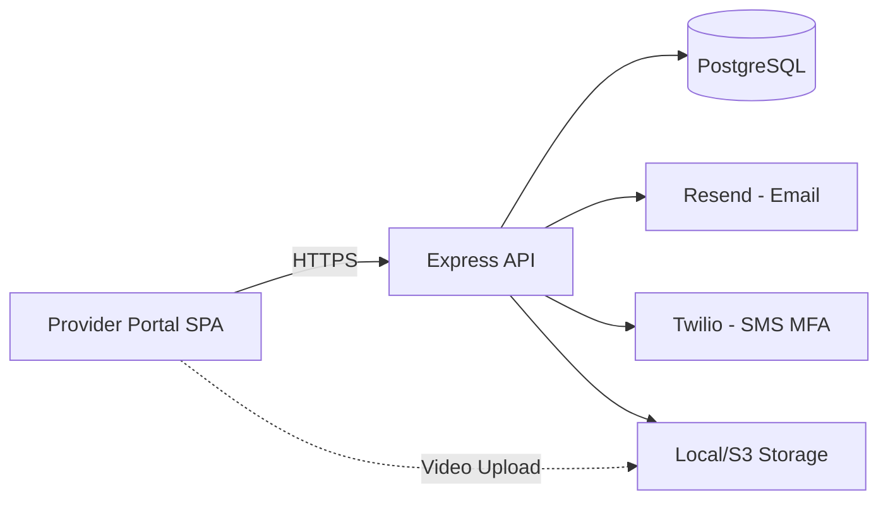
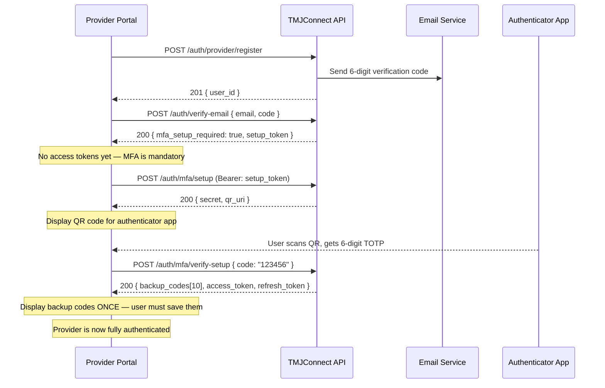
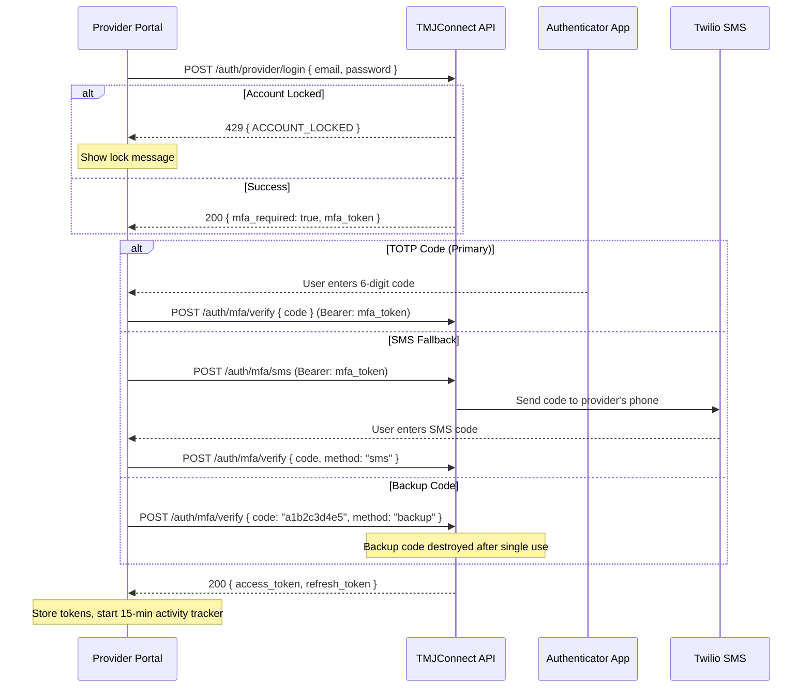
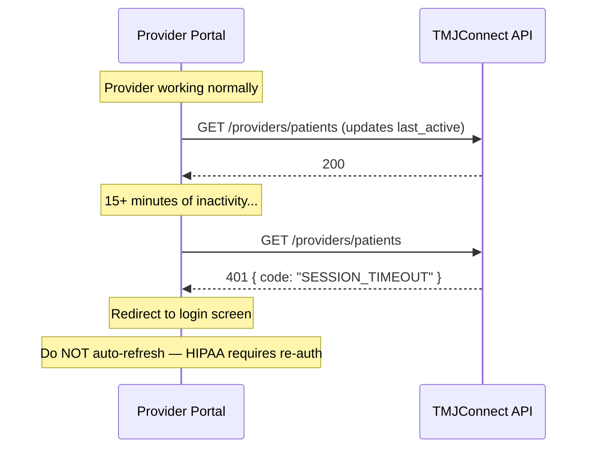
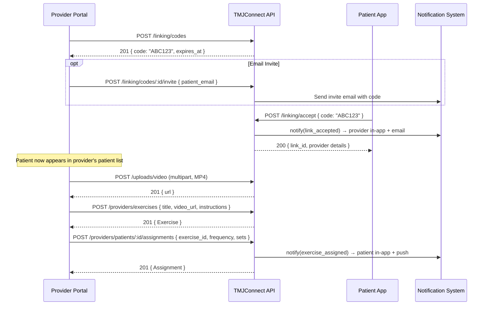
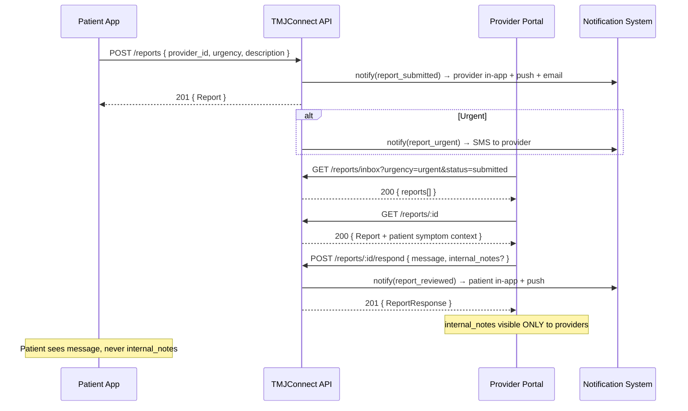
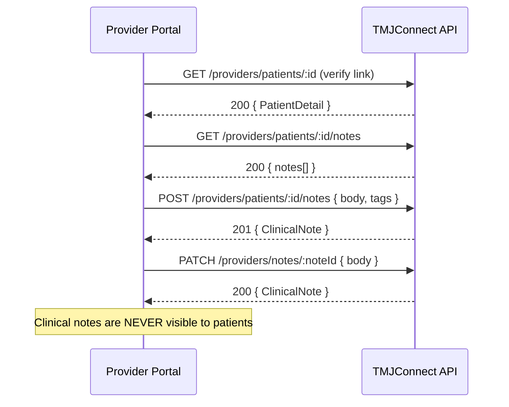

# TMJConnect — Provider Portal Integration Guide

Sequential API flow for integrating the provider web portal with the TMJConnect API.

**Base URL:** `/api/v1`
**Auth:** Bearer JWT in `Authorization` header
**MFA:** Required for all providers before first login
**Session timeout:** 15 minutes of inactivity → 401 SESSION_TIMEOUT

---

## Architecture Overview



## Flow Diagrams

### Complete Registration + MFA Setup Flow



### Login Flow (MFA Required)



### Session Timeout (HIPAA 15-min Inactivity)



### Patient Linking + Exercise Assignment Flow



### Report Response Flow



### Clinical Notes Flow



---

## Phase 1: Registration & MFA Setup

### Step 1 — Register

```
POST /auth/provider/register
Body: {
  email, password, first_name, last_name, phone?,
  license_number, license_type, specialty, clinic_name, credentials?
}
→ 201 { data: { message, user_id } }
```

### Step 2 — Verify Email

```
POST /auth/verify-email
Body: { email, code }
→ 200 { data: { mfa_setup_required: true, setup_token: "..." } }
```

Providers do NOT get access tokens yet — MFA setup is mandatory first.

### Step 3 — Setup MFA (Required)

**3a. Initialize TOTP:**
```
POST /auth/mfa/setup
Headers: Authorization: Bearer <setup_token>
→ 200 { data: { secret, qr_uri } }
```

Display `qr_uri` as a QR code. User scans with authenticator app (Google Authenticator, Authy).

**3b. Verify TOTP + Get Backup Codes:**
```
POST /auth/mfa/verify-setup
Headers: Authorization: Bearer <setup_token>
Body: { code: "123456" }  // 6-digit TOTP from authenticator
→ 200 { data: { message, backup_codes: [...10 codes], access_token, refresh_token } }
```

**Critical:** Display backup codes once. They are never shown again. User must save them securely.

Provider is now fully authenticated with access + refresh tokens.

---

## Phase 2: Login (with MFA)

### Step 1 — Email + Password

```
POST /auth/provider/login
Body: { email, password }
→ 200 { data: { mfa_required: true, mfa_token: "..." } }
→ 429 { error: { code: "ACCOUNT_LOCKED" } }  // 5+ failures
```

Providers always get `mfa_required: true` — never direct tokens.

### Step 2 — MFA Verification

**Option A — TOTP code:**
```
POST /auth/mfa/verify
Headers: Authorization: Bearer <mfa_token>
Body: { code: "123456" }
→ 200 { data: { access_token, refresh_token } }
```

**Option B — SMS fallback:**
```
POST /auth/mfa/sms
Headers: Authorization: Bearer <mfa_token>
→ 200 { data: { message: "Code sent" } }

POST /auth/mfa/verify
Headers: Authorization: Bearer <mfa_token>
Body: { code: "123456", method: "sms" }
→ 200 { data: { access_token, refresh_token } }
```

**Option C — Backup code:**
```
POST /auth/mfa/verify
Headers: Authorization: Bearer <mfa_token>
Body: { code: "a1b2c3d4e5", method: "backup" }
→ 200 { data: { access_token, refresh_token } }
```

Each backup code is single-use and destroyed on use.

### Token Refresh

```
POST /auth/refresh
Body: { refresh_token }
→ 200 { data: { access_token, refresh_token } }
```

### Session Timeout

Every authenticated request updates `last_active`. If the gap exceeds 15 minutes:
```
Any request → 401 { error: { code: "SESSION_TIMEOUT" } }
```

The portal must redirect to the login screen on this error.

---

## Phase 3: Provider Dashboard

### Patient List

```
GET /providers/patients
→ 200 { data: PatientSummary[] }
```

Each entry includes: `patient_id`, `first_name`, `last_name`, `last_active`, `avg_pain_7d`, `exercise_adherence_pct`, `linked_at`.

### Dashboard Summary

```
GET /providers/dashboard/summary
→ 200 { data: { total_patients, active_today, pending_reports, avg_response_time, ... } }
```

### Patient Detail

Requires active link. Returns profile + recent metrics.
```
GET /providers/patients/:patientId
→ 200 { data: PatientDetail }
→ 403 { error: { code: "FORBIDDEN", message: "Patient is not linked to your account." } }
```

### Patient Symptom History

```
GET /providers/patients/:patientId/symptoms?limit=20&cursor=<logged_at>
→ 200 { data: SymptomLog[], meta: { nextCursor, hasMore } }
```

### Patient Reports

```
GET /providers/patients/:patientId/reports?limit=20
→ 200 { data: Report[] }
```

---

## Phase 4: Exercise Library

### CRUD

```
GET /providers/exercises → Exercise[]

POST /providers/exercises
Body: { title, description?, duration_seconds?, category?, instructions?, video_url?, thumbnail_url? }
→ 201 { data: Exercise }

PATCH /providers/exercises/:exerciseId
Body: { title?, description?, ... }
→ 200 { data: Exercise }

DELETE /providers/exercises/:exerciseId → 204
```

### Upload Exercise Video

```
POST /uploads/video
Content-Type: multipart/form-data
Body: file (MP4/MOV, max 100MB, magic bytes validated)
→ 201 { data: { url, key, size, mime_type } }
```

Use returned `url` as `video_url` when creating/updating an exercise.

---

## Phase 5: Exercise Assignments

### Assign to Patient

```
POST /providers/patients/:patientId/assignments
Body: { exercise_id, frequency: "daily"|"3x weekly"|..., sets: 3 }
→ 201 { data: Assignment }
→ 403 (patient not linked)
```

### View Patient's Assignments

```
GET /providers/patients/:patientId/assignments
→ 200 { data: Assignment[] }
```

Each includes completion stats: `completed_today`, `total_completions`, `last_completed_at`.

### Update Assignment

```
PATCH /providers/assignments/:assignmentId
Body: { frequency?, sets?, status?: "active"|"paused"|"completed" }
→ 200 { data: Assignment }
```

### Remove Assignment

```
DELETE /providers/assignments/:assignmentId → 204
```

---

## Phase 6: Reports

### Inbox

```
GET /reports/inbox?urgency=urgent&status=submitted&limit=20
→ 200 { data: Report[], meta: { nextCursor, hasMore } }
```

Sorted by urgency (urgent first) then date. Filterable by urgency, status, provider.

### Report Detail

```
GET /reports/:id
→ 200 { data: Report }
```

Includes `responses[]` and `internal_notes` (provider-only, never shown to patient).

### Respond to Patient

```
POST /reports/:id/respond
Body: { message: "...", internal_notes?: "..." }
→ 201 { data: ReportResponse }
```

Patient sees `message`. `internal_notes` is provider-only.

### Review (Without Responding)

```
PATCH /reports/:id/review
→ 200 { data: Report }  // status → "reviewed"
```

### Flag Report

```
PATCH /reports/:id/flag
Body: { flagged: true }
→ 200 { data: Report }
```

### Request Report from Patient

```
POST /providers/patients/:patientId/report-requests
Body: { prompt: "Please submit a progress report for this week." }
→ 201 { data: ReportRequest }
```

---

## Phase 7: Clinical Notes

### CRUD

```
GET /providers/patients/:patientId/notes?limit=20 → ClinicalNote[]

POST /providers/patients/:patientId/notes
Body: { body: "...", tags?: ["follow-up", "medication"] }
→ 201 { data: ClinicalNote }

PATCH /providers/notes/:noteId
Body: { body?, tags? }
→ 200 { data: ClinicalNote }

DELETE /providers/notes/:noteId → 204
```

Clinical notes are never visible to patients.

---

## Phase 8: Patient Linking

### Generate Invite Code

```
POST /linking/codes
→ 201 { data: { id, code: "ABC123", expires_at, status: "pending" } }
```

Code is 6 alphanumeric characters, valid for 7 days.

### Send Email Invite

```
POST /linking/codes/:codeId/invite
Body: { patient_email: "patient@example.com" }
→ 200 { data: { message } }
```

### View Codes

```
GET /linking/codes
→ 200 { data: LinkingCode[] }
```

### Disconnect Patient

```
DELETE /linking/links/:linkId
→ 204  // soft delete (sets unlinked_at)
```

### View Active Links

```
GET /linking/links
→ 200 { data: ProviderLink[] }
```

---

## Phase 9: Notifications

### List

```
GET /notifications?limit=20&cursor=<created_at>
→ 200 { data: Notification[], meta: { nextCursor, hasMore } }
```

### Mark Read

```
PATCH /notifications/:id/read → 200
```

### Notification Preferences

```
GET /providers/notifications/preferences-summary → preferences
PATCH /providers/notifications/preferences → updated
```

---

## Phase 10: Profile & Sessions

### View / Update Profile

```
GET /providers/me → ProviderProfile
PATCH /providers/me
Body: { first_name?, last_name?, specialty?, clinic_name?, ... }
→ 200 { data: ProviderProfile }
```

### Upload Avatar

```
POST /uploads/avatar (multipart, JPEG/PNG, max 5MB)
→ 201 { data: { url } }

PATCH /providers/me { avatar_url: url }
```

### Sessions

```
GET /providers/me/sessions → Session[]
DELETE /providers/sessions/:id → 204
```

### Change Password

```
PATCH /auth/change-password
Body: { current_password, new_password }
→ 200
```

### Disable / Reset MFA

```
DELETE /auth/patient/mfa  // also works for providers
Body: { password }
→ 200

// Then re-setup:
POST /auth/mfa/setup → { secret, qr_uri }
POST /auth/mfa/verify-setup → { backup_codes, access_token, refresh_token }
```

---

## Error Handling

All errors follow:
```json
{
  "error": {
    "code": "ERROR_CODE",
    "message": "Human-readable message",
    "details": [...]  // present on VALIDATION_ERROR
  }
}
```

| Code | HTTP | When |
|------|------|------|
| VALIDATION_ERROR | 400 | Invalid request body/query |
| UNAUTHORIZED | 401 | Missing or expired token |
| SESSION_TIMEOUT | 401 | 15-min inactivity (providers) |
| FORBIDDEN | 403 | Patient not linked / wrong role |
| NOT_FOUND | 404 | Resource doesn't exist or not owned |
| CONFLICT | 409 | Duplicate (email, link, etc.) |
| ACCOUNT_LOCKED | 429 | Too many failed login attempts |

---

## HIPAA Compliance Notes

1. **All requests are audited.** Every state-changing request creates an `audit_logs` entry.
2. **internal_notes are never exposed to patients.** The patient-facing report detail endpoint strips this field.
3. **Provider link required.** All patient data access requires an active `patient_provider_links` entry with `unlinked_at IS NULL`.
4. **15-minute timeout.** Enforce logout on `SESSION_TIMEOUT` — do not auto-refresh.
5. **MFA is mandatory.** Providers cannot access the system without completing MFA setup.
