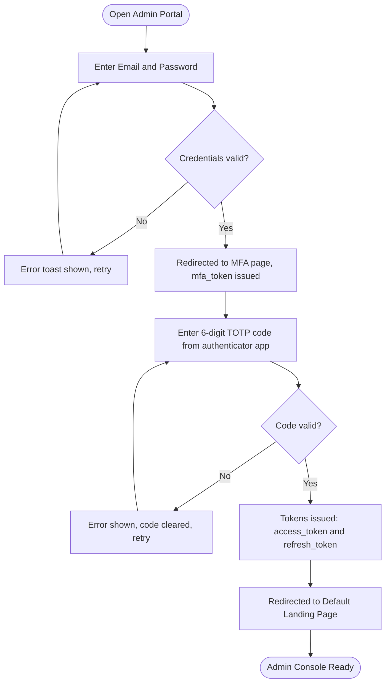
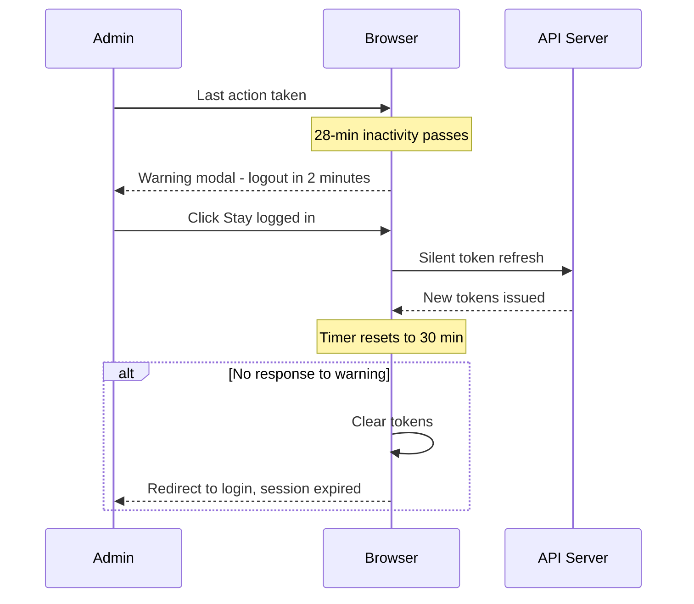
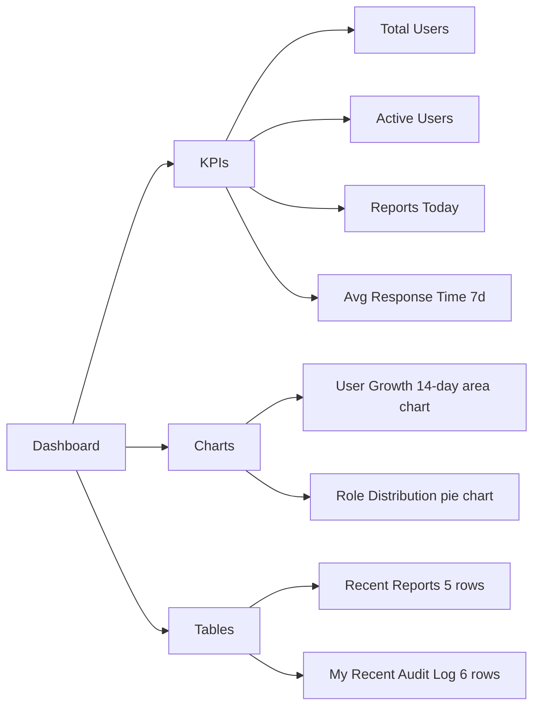
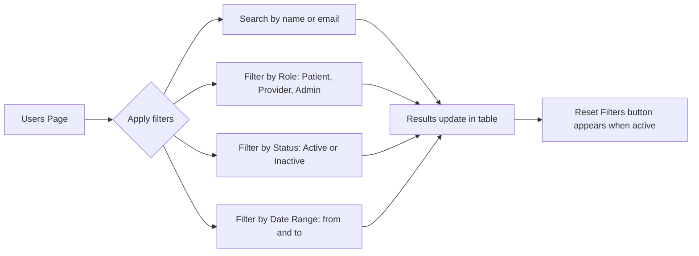
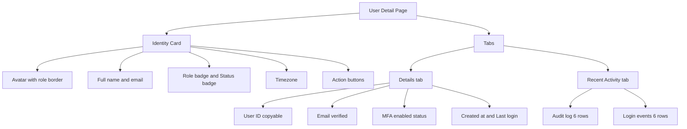
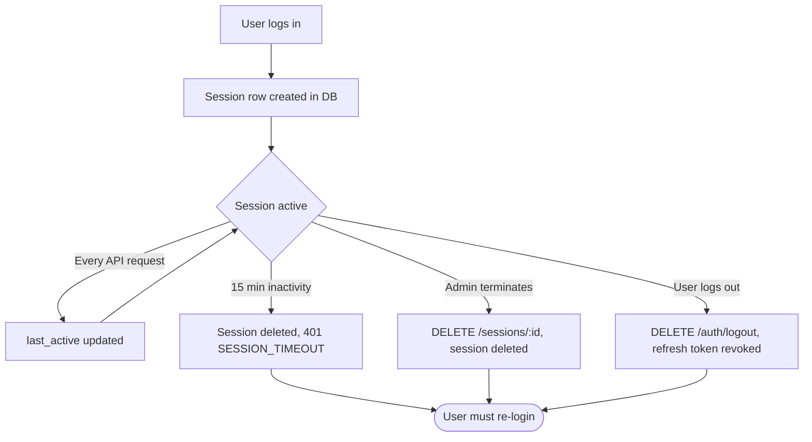

# TMJConnect — Admin Console User Guide

> **Audience:** System administrators with the `admin` role.  
> **Portal URL:** `http://localhost:5173` (development)  
> **Prerequisite:** A seeded database — run `npm run db:seed` from `apps/api/`.

---

## Table of Contents

1. [First-Time Setup](#1-first-time-setup)
2. [Logging In & MFA](#2-logging-in--mfa)
3. [Session Management & Timeouts](#3-session-management--timeouts)
4. [Dashboard Overview](#4-dashboard-overview)
5. [Managing Users](#5-managing-users)
6. [User Detail & Actions](#6-user-detail--actions)
7. [Audit Logs](#7-audit-logs)
8. [Login Events](#8-login-events)
9. [Reports Viewer](#9-reports-viewer)
10. [Security Dashboard](#10-security-dashboard)
11. [Active Sessions](#11-active-sessions)
12. [Background Jobs](#12-background-jobs)
13. [Settings & Preferences](#13-settings--preferences)
14. [Help & Keyboard Shortcuts](#14-help--keyboard-shortcuts)
15. [Error Reference](#15-error-reference)

---

## 1. First-Time Setup

### Prerequisites

Before you log in for the first time, confirm the following with your system engineer:

- The API is running and accessible (check `/health` returns `200 OK`).
- An admin account has been created for you (or use the seed admin in development).
- You have an authenticator app installed on your phone: **Google Authenticator**, **Authy**, or any TOTP-compatible app.

### Development Seed Credentials

| Field    | Value                   |
|----------|-------------------------|
| Email    | `admin@tmjconnect.dev`  |
| Password | `Test@1234!`            |
| MFA      | TOTP secret `JBSWY3DPEHPK3PXP` (add to authenticator app) |

---

## 2. Logging In & MFA

### Full Authentication Flow

### Step-by-Step

#### Step 1 — Login Page (`/login`)

1. Navigate to the admin portal URL.
2. Enter your **Email** and **Password**.
3. Click **Log in**.

> **Validation rules:** Email must be a valid format. Password must not be empty.

#### Step 2 — MFA Verification Page (`/mfa`)

1. Open your authenticator app.
2. Find the **TMJConnect Admin** entry.
3. Enter the **6-digit TOTP code** (changes every 30 seconds).
4. Click **Verify**.

- If the code is wrong: the input clears and an error is shown — re-enter a fresh code.
- If your code has just expired: wait for the next 30-second window.
- There is no "Back to Login" link once on the MFA page — close and reopen the browser tab to restart.

#### Token Lifecycle

| Token          | Lifetime  | Storage         |
|----------------|-----------|-----------------|
| `access_token` | 15 minutes | Client memory  |
| `refresh_token`| 7 days    | Secure storage  |

When the access token expires, a silent refresh is attempted automatically. If the refresh also fails (e.g., token revoked), you are redirected to `/login`.

---

## 3. Session Management & Timeouts

### 30-Minute Inactivity Timeout

The admin portal enforces a **30-minute inactivity timeout**.

### Concurrent Sessions

If you log in from a second device, both sessions remain valid simultaneously. To view or terminate other sessions, go to **Security → Active Sessions**.

---

## 4. Dashboard Overview

### KPI Cards

Each card shows:
- **Current value** with an up/down delta vs. the previous period
- A **sparkline** (7-day mini-chart)
- A coloured trend indicator (green = improving, red = declining)

### Urgent Report Alerts

If there are unreviewed urgent reports, an **alert strip** appears at the top of the dashboard with three clickable shortcuts:

| Alert Card             | Links To                              |
|------------------------|---------------------------------------|
| Urgent (waiting >1h)   | Reports page filtered to `urgent`     |
| Critical (waiting >4h) | Reports page filtered to `urgent`     |
| All pending            | Reports page filtered to `submitted`  |

### Auto-Refresh

- Dashboard KPIs poll every **10 seconds**.
- Toggle auto-refresh off using the **Live** toggle in the top-right of the page header.

---

## 5. Managing Users

### Navigating to Users (`/users`)

Click **Users** in the sidebar under **Management**.

### Filter & Search

Filters sync to the URL, so the filtered view can be bookmarked or shared.

### User Table Columns

| Column           | Description                                           |
|------------------|-------------------------------------------------------|
| Avatar + Name    | Initials avatar, full name                            |
| Email            | Click the copy icon to copy to clipboard              |
| Role             | Admin (red), Provider (teal), Patient (blue)          |
| Status           | Green dot = Active, grey dot = Inactive               |
| Email Verified   | ✓ or ✗                                                |
| MFA Enabled      | ✓ or ✗                                                |
| Created At       | Relative time (e.g., "3 days ago")                    |
| Actions          | Eye icon (view detail), Active toggle                 |

Column visibility can be toggled using the **Columns** button above the table.

### Activating / Deactivating a User

1. Find the user row.
2. Click the **status toggle** (green/grey dot) in the Actions column.
3. A confirmation modal appears: **"Activate this user?"** or **"Deactivate this user?"**
4. Click **Confirm**.

> A deactivated user cannot log in and receives a `403 FORBIDDEN` with reason `account_deactivated`.

### Exporting Users

1. To export **all users**: click **Export** → **Export all users**.
2. To export **selected users**: tick the checkboxes on the rows you want, then click **Export** → **Export selected**.

Both options download a `.csv` file with all visible columns.

---

## 6. User Detail & Actions

### Navigating to User Detail (`/users/:id`)

Click any row in the Users table, or click the **Eye icon** in the Actions column. 

### Page Layout

### Available Actions

| Action                  | What It Does                                                      |
|-------------------------|-------------------------------------------------------------------|
| **Force Password Reset**| Flags the account so the user must reset their password on next login. Confirmation required. |
| **Force MFA Reset**     | Clears the MFA secret. User must re-enrol their authenticator on next login. Confirmation required. |
| **Activate / Deactivate** | Toggle the `is_active` flag. Same as the toggle in the Users table. |

> All actions are recorded in the **Audit Logs** automatically.

### Viewing Activity

**Details tab**

Shows all identity fields in a read-only grid. Copyable fields (like User ID) have a copy icon.

**Recent Activity tab**

- **Audit log** (last 6 actions): Action label, resource type, timestamp, IP address.
- **Login events** (last 6): Success/failure icons, email, device string, IP, timestamp.

---

## 7. Audit Logs

### Navigating to Audit Logs (`/audit-logs`)

Click **Audit Logs** in the sidebar under **Security**.

### Filter Presets

The Audit Logs page includes built-in quick-filter presets:

| Preset                    | What It Applies                           |
|---------------------------|-------------------------------------------|
| Failed logins (24h)       | Action = `auth.login.failed`, last 24 h   |
| Admin actions today       | Action prefix `admin.*`, today            |
| PHI access today          | Resource type = `symptom_log`, today      |

To use a preset: click its button in the filter toolbar. The filters populate automatically.

### Custom Filters

| Filter          | Input Type                         |
|-----------------|------------------------------------|
| User ID         | Text (UUID or partial)             |
| Action          | Dropdown of all known audit actions|
| Resource Type   | Dropdown (user, report, linking_code, symptom_log, etc.) |
| Date Range      | From / To date pickers             |

### Saving Custom Filter Presets

1. Apply your filters.
2. Click **Save preset**.
3. Enter a name and click **Save**.

Presets persist in `localStorage`. You can rename or delete them at any time.

### Table

| Column       | Notes                                                            |
|--------------|------------------------------------------------------------------|
| Created At   | Relative time                                                    |
| Action       | Coloured tag: blue=auth, red=admin, teal=provider, orange=report |
| Resource     | `resource_type` + `resource_id` (both copyable)                  |
| User ID      | Copyable UUID chip                                               |
| IP Address   | Copyable                                                         |

Default page size is **50 rows**.

### Audit Detail Drawer

Click any row to open a right-side drawer showing:

- Full action name
- Raw `metadata` JSON (request method, path, HTTP status code, user agent)
- Request ID
- All timestamps

---

## 8. Login Events

### Navigating (`/login-events`)

Click **Login Events** in the sidebar under **Security**.

### Filters

| Filter    | Options                                      |
|-----------|----------------------------------------------|
| User ID   | Text                                         |
| Success   | Any / Success only / Failures only           |
| Date Range| From / To                                    |

### Table

| Column         | Notes                                                                     |
|----------------|---------------------------------------------------------------------------|
| When           | Relative time                                                             |
| Email          | The email entered at login                                                |
| Status         | ✓ Success (green) or ✗ Failed (red)                                       |
| Reason         | Only on failures: `invalid_password`, `account_locked`, `account_deactivated`, `email_not_verified` |
| IP             | Copyable                                                                  |
| Device         | User-agent string (truncated at 500 chars)                                |

Page size: **50 rows**. Exportable to CSV.

---

## 9. Reports Viewer

### Navigating (`/reports`)

Click **Reports** in the sidebar under **Management**.

### Filters

| Filter        | Options                                                         |
|---------------|-----------------------------------------------------------------|
| Search        | Patient name or provider name (free text)                       |
| Urgency       | Routine / Concerning / Urgent                                   |
| Status        | Submitted / Viewed / Reviewed / Responded                       |
| Date Range    | From / To date pickers                                          |

### Table

| Column       | Notes                                                                        |
|--------------|------------------------------------------------------------------------------|
| Submitted At | Relative time                                                                |
| Patient      | Full name                                                                    |
| Provider     | Full name                                                                    |
| Urgency      | Red tag = Urgent, orange tag = Concerning, grey tag = Routine                |
| Pain Level   | 0–10 progress bar; red ≥7, orange ≥4, green <4                               |
| Status       | Blue=Submitted, Cyan=Viewed, Green=Reviewed, Purple=Responded                |
| Flagged      | Flag icon if provider has flagged the report for follow-up                   |

> **Note:** Full report detail view is on the roadmap. The Reports page is currently a read-only monitoring tool for admins.

---

## 10. Security Dashboard

### Navigating (`/security`)

Click **Security** in the sidebar under **Security**.

### Time Window

Select a time window using the toggle at the top: **1h / 6h / 12h / 24h / 7d**.

### KPI Grid

| Metric             | Warning Threshold  | Alert Threshold |
|--------------------|-------------------|-----------------|
| Failed logins      | >20               | >5              |
| Token replays      | —                 | >0 (red always)  |
| New device logins  | Info (blue)        | —               |
| Rate limit hits    | >0                | —               |

> **Token replays** indicate a possible session-hijacking attempt. Investigate immediately by checking the IP in the Login Events page.

### Charts & Tables

- **Hourly failed logins** — area chart over the selected time window.
- **Top IPs** — table of IP addresses with the highest failed login counts.
- **Top emails** — table of email addresses with the highest failed login attempts (may indicate credential stuffing).

---

## 11. Active Sessions

### Navigating (`/sessions`)

Click **Active Sessions** in the sidebar under **Security**.

### Session Lifecycle

### Filters

Role filter: **Any / Patient / Provider / Admin**

### Table

| Column      | Notes                                               |
|-------------|-----------------------------------------------------|
| User        | Email + copyable User ID                            |
| Role        | Colour-coded badge                                  |
| IP Address  | Copyable                                            |
| Device      | User-agent string                                   |
| Last Active | Relative time                                       |
| Action      | **Terminate session** button (confirmation required) |

### KPI Summary

Above the table:
- **Total active sessions**
- Breakdown by role: Patients / Providers / Admins

---

## 12. Background Jobs

### Navigating (`/jobs`)

Click **Jobs** in the sidebar under **Operations**.

### Job Cards

Each job is shown as a card:

| Field          | Description                                          |
|----------------|------------------------------------------------------|
| Name           | Job identifier (e.g., `code_expiry_job`)             |
| Schedule       | Cron expression (e.g., `0 * * * *` = hourly)         |
| Last Run       | Status icon + duration + rows affected               |
| Success Rate   | Last 24 hours %                                      |
| Avg Duration   | 7-day average execution time                         |
| Trigger Now    | Manually enqueue the job immediately                 |

### Job History Drawer

Click any job card to open its history:

- **Run ID** — unique identifier per execution
- **Status** — `running` / `success` / `failed` / `skipped`
- **Start Time** — absolute timestamp
- **Duration** — milliseconds
- **Rows Affected** — rows touched by that run
- **Error Message** — populated only on `failed` status

---

## 13. Settings & Preferences

### Navigating (`/settings`)

Click **Settings** in the sidebar under **Workspace**.

### Appearance

| Setting  | Options                      | Persistence  |
|----------|------------------------------|--------------|
| Theme    | Light / Dark                 | localStorage |
| Density  | Comfortable / Compact        | localStorage |

> Keyboard shortcut: press **`t`** anywhere in the portal to instantly toggle the theme.

### Locale

| Setting      | Options                                                   |
|--------------|-----------------------------------------------------------|
| Time Zone    | Dropdown of major zones (UTC, US, Asia, AU) + System default |
| Time Format  | 12-hour / 24-hour                                         |

### Workflow

| Setting               | Options                                                  |
|-----------------------|----------------------------------------------------------|
| Default Landing Page  | Dashboard / Users / Audit Logs / Login Events / Reports  |

This controls where you land after every login.

### Advanced

| Setting        | Description                                                                   |
|----------------|-------------------------------------------------------------------------------|
| Read-Only Mode | Disables all mutation buttons in the UI (safety net, does not enforce on API) |
| System Health  | Pings `/admin/stats` — shows total users and API status                       |

### Maintenance Actions

| Action                   | What It Does                                                  |
|--------------------------|---------------------------------------------------------------|
| Clear recently viewed    | Removes recently-visited page history from localStorage       |
| Clear notifications      | Clears the toast notification history drawer                  |

---

## 14. Help & Keyboard Shortcuts

### Navigating (`/help`)

Click **Help** in the sidebar under **Workspace**, or press **`?`** anywhere in the portal.

### Keyboard Shortcuts

| Shortcut      | Action                                   |
|---------------|------------------------------------------|
| `⌘K`          | Open command palette (global search)     |
| `?`           | Open help modal                          |
| `t`           | Toggle light / dark theme                |
| `/`           | Focus the search box on the current page |
| `g d`         | Go to Dashboard                          |
| `g u`         | Go to Users                              |
| `g a`         | Go to Audit Logs                         |
| `g l`         | Go to Login Events                       |
| `g r`         | Go to Reports                            |
| `↑ ↓`         | Navigate command palette results         |
| `Enter`       | Select command palette item              |
| `Esc`         | Close modal / drawer / palette           |

### Global Search (`⌘K`)

1. Press `⌘K` (Mac) or `Ctrl+K` (Windows/Linux).
2. Type a user name, email, or page name.
3. Use `↑` / `↓` to move through results.
4. Press `Enter` to navigate.

### FAQ

**Where do my preferences live?**
All settings (theme, density, timezone, default landing) are stored in your browser's `localStorage`. They persist across sessions on the same browser but do not sync across devices.

**What does Read-Only mode do?**
It disables buttons like "Deactivate User" and "Force Reset" in the UI only. The underlying API is not restricted. Use it as a safety net when monitoring without acting.

**How does live activity work?**
The dashboard polls the API every 10 seconds. The Users page polls every 30 seconds when the Live toggle is on. Turn the toggle off to stop polling.

**How do I export selected rows?**
Tick the checkboxes on the left of each row you want, then click **Export → Export selected**.

**Can I share a filtered view?**
Yes. Filters are reflected in the URL as query parameters. Copy the URL from your browser and share it — anyone with access will land on the same filtered view.

---

## 15. Error Reference

### Authentication Errors

| Code                  | Message                                  | What to do                                        |
|-----------------------|------------------------------------------|---------------------------------------------------|
| `UNAUTHORIZED`        | "Missing or invalid token"               | Log in again                                      |
| `SESSION_TIMEOUT`     | "Session expired due to inactivity"      | Log in again                                      |
| `FORBIDDEN`           | "Insufficient permissions"               | Confirm your account has the `admin` role         |
| `MFA_REQUIRED`        | "MFA verification required"              | Complete MFA step                                 |
| `ACCOUNT_DEACTIVATED` | "This account has been deactivated"      | Contact another admin to reactivate your account  |

### Rate Limiting

| Endpoint                     | Limit                    | Reset window |
|------------------------------|--------------------------|--------------|
| Login (`/auth/admin/login`)  | 5 attempts               | 15 minutes   |
| MFA verify (`/auth/mfa/...`) | 5 attempts               | 15 minutes   |
| General API                  | Per-IP threshold (server-configured) | Rolling window |

After hitting a rate limit: **wait for the reset window to expire** before retrying. Do not retry rapidly as this resets the lockout timer on the server.

### General Errors

| Code               | Meaning                                             |
|--------------------|-----------------------------------------------------|
| `VALIDATION_ERROR` | A submitted form field failed validation. Check the inline field errors. |
| `NOT_FOUND`        | The resource (user, session, etc.) no longer exists. Refresh the page. |
| `CONFLICT`         | Duplicate operation (e.g., user already has that email). |
| `INTERNAL`         | Unexpected server error. Check API logs.            |
