# TMJConnect — Provider Portal User Guide

> **Audience:** Licensed healthcare providers (dentists, orthodontists, physical therapists) with the `provider` role.  
> **Portal URL:** `http://localhost:5174` (development)  
> **Prerequisite:** An admin must have created your account, or you can self-register via the registration page.

---

## Table of Contents

1. [First-Time Registration](#1-first-time-registration)
2. [Email Verification](#2-email-verification)
3. [Mandatory MFA Setup](#3-mandatory-mfa-setup)
4. [Logging In (Returning Users)](#4-logging-in-returning-users)
5. [Session Management & Timeouts](#5-session-management--timeouts)
6. [Dashboard Overview](#6-dashboard-overview)
7. [Managing Your Patient List](#7-managing-your-patient-list)
8. [Patient Detail View](#8-patient-detail-view)
9. [Exercise Library](#9-exercise-library)
10. [Assigning Exercises to Patients](#10-assigning-exercises-to-patients)
11. [Report Inbox](#11-report-inbox)
12. [Responding to a Report](#12-responding-to-a-report)
13. [Linking — Connecting New Patients](#13-linking--connecting-new-patients)
14. [Notifications](#14-notifications)
15. [Account Settings](#15-account-settings)
16. [Active Sessions & Security](#16-active-sessions--security)
17. [Password Management](#17-password-management)
18. [Error Reference](#18-error-reference)

---

## 1. First-Time Registration

### Development Seed Accounts

If you are in development and just want to log straight in, skip registration:

| Provider               | Email                         | Password     | MFA TOTP Secret     |
|------------------------|-------------------------------|--------------|---------------------|
| Sarah Smith — DDS      | `dr.smith@tmjconnect.dev`     | `Test@1234!` | `JBSWY3DPEHPK3PXP`  |
| Michael Jones — DMD    | `dr.jones@tmjconnect.dev`     | `Test@1234!` | `JBSWY3DPEHPK3PXP`  |
| Lisa Chen — PT         | `dr.chen@tmjconnect.dev`      | `Test@1234!` | `JBSWY3DPEHPK3PXP`  |

Add `JBSWY3DPEHPK3PXP` as a manual TOTP entry in your authenticator app to generate codes.

### New Account Registration Flow

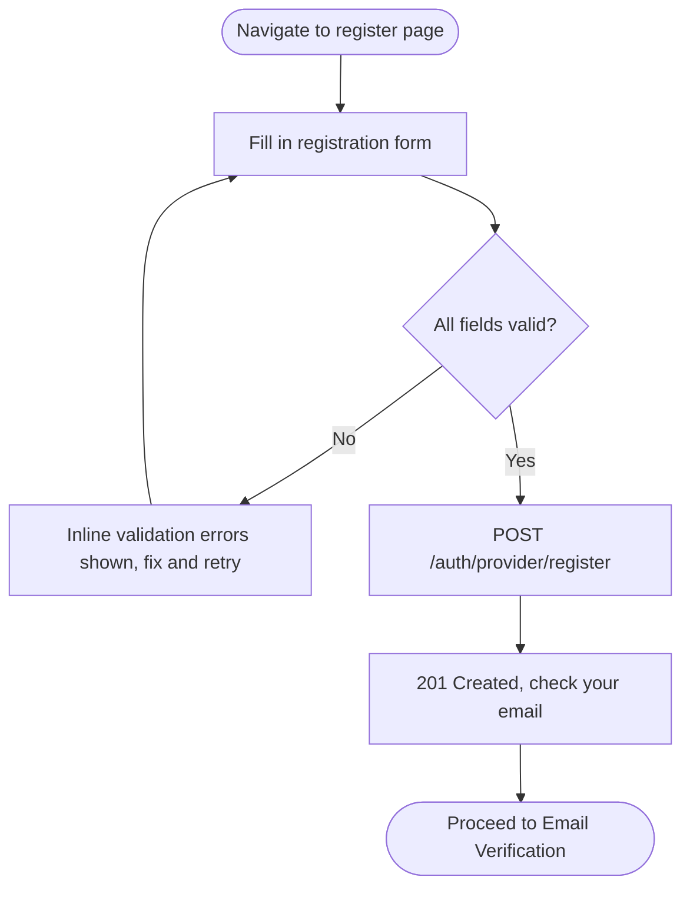

### Registration Form Fields

All fields are required unless marked optional.

| Field            | Format / Rules                                                                     |
|------------------|------------------------------------------------------------------------------------|
| Email            | Valid email format. Must be unique in the system.                                  |
| Password         | Min 8 characters. Must include at least 1 digit and 1 special character.           |
| First Name       | Text                                                                               |
| Last Name        | Text                                                                               |
| Phone            | E.164 format e.g. `+15551234567`. Required for SMS MFA fallback.                   |
| Timezone         | IANA timezone string e.g. `America/Chicago`                                        |
| License Number   | Your professional license number e.g. `TX-DDS-001`                                |
| License Type     | e.g. `DDS`, `DMD`, `RDH`, `PT`                                                     |
| Specialty        | e.g. `Orofacial Pain`, `Oral Surgery`, `Physical Therapy`                          |
| Clinic Name      | Name of your practice or clinic                                                    |
| Credentials      | *(optional)* Additional titles e.g. `["DDS", "FAAOP"]`                            |

---

## 2. Email Verification

After registration, a 6-digit verification code is sent to your email address.

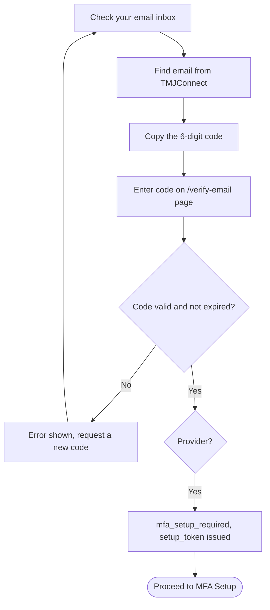

**Code expiry:** 15 minutes. If yours expires, click **Resend code** on the verification page.

**Rate limit:** 3 resend attempts per hour per email address.

---

## 3. Mandatory MFA Setup

MFA is **mandatory** for all provider accounts and cannot be disabled. This is a HIPAA requirement.  
This setup only happens **once** after your first email verification.

### Full MFA Setup Flow

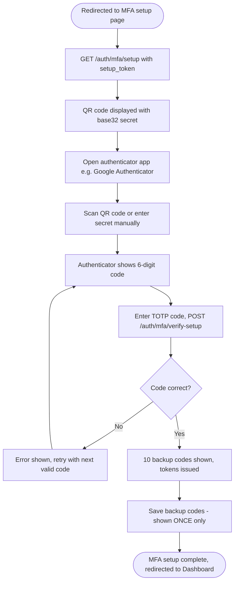

### Step-by-Step

1. You are automatically redirected to `/mfa/setup` after email verification.
2. A **QR code** is displayed. Open your authenticator app and scan it.
   - If your app does not have a scanner, tap **Enter manually** and type in the displayed base32 secret.
3. Your authenticator now shows a **6-digit rotating code** for TMJConnect.
4. Enter that code in the box on screen and click **Verify**.
5. If the code is accepted, **10 backup codes** are displayed.

### Saving Your Backup Codes

> ⚠️ **Critical:** Backup codes are shown **exactly once**. If you lose your authenticator app and have not saved them, you will need to contact an admin to reset your MFA.

- Copy all 10 codes and store them in a secure location (password manager, printed, locked safe).
- Each backup code can be used **once** and is then invalidated.
- After all 10 are used, contact an admin to reset your MFA so you can re-enrol.

---

## 4. Logging In (Returning Users)

### Login Flow

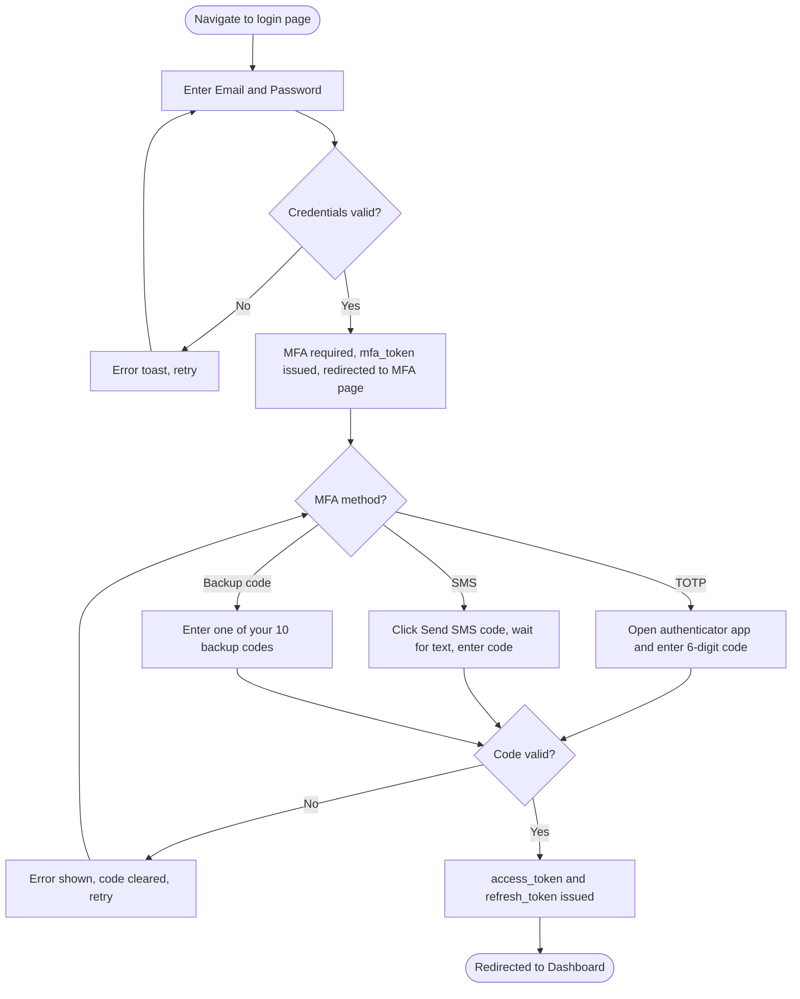

### MFA Code Types

| Type         | How to use                                                                                |
|--------------|-------------------------------------------------------------------------------------------|
| **TOTP**     | Open authenticator app → find TMJConnect → enter the current 6-digit code.                |
| **SMS**      | Click **Send SMS code** on the MFA page → wait for a text to your registered phone → enter the code. |
| **Backup code** | Enter any unused backup code from your saved list. It is invalidated after one use.   |

> SMS codes take up to 60 seconds to arrive. Do not request more than once unless it truly has not arrived.

---

## 5. Session Management & Timeouts

### 15-Minute Inactivity Timeout

Provider sessions have a stricter **15-minute inactivity timeout** (HIPAA requirement).

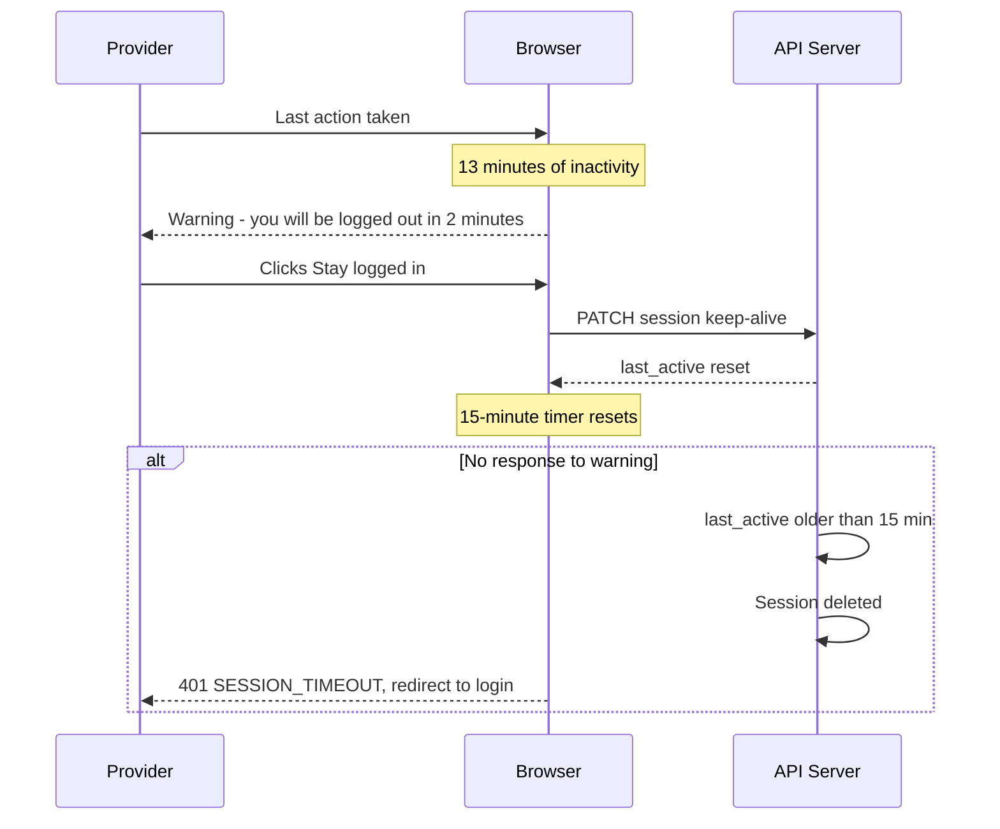

Every API request automatically extends your session. If you are actively using the portal, you will not be timed out.

### Token Lifecycle

| Token          | Lifetime   | Behaviour on expiry                          |
|----------------|------------|----------------------------------------------|
| `access_token` | 15 minutes | Silent refresh attempted automatically        |
| `refresh_token`| 7 days     | Requires full re-login on expiry              |

---

## 6. Dashboard Overview

The dashboard is your first view after login. It gives you an immediate summary of what needs your attention.

### Layout

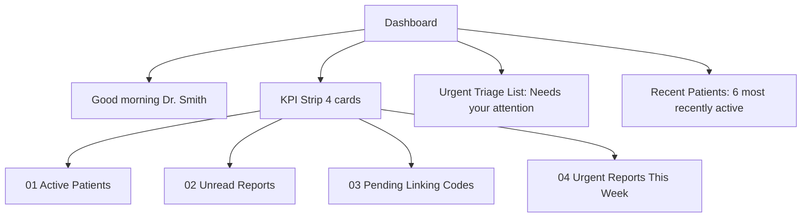

### Urgent Triage List

If you have urgent or flagged reports, they appear here sorted by most urgent first.

Each entry shows:
- **URGENT** badge
- Patient name
- Description preview (truncated)
- Flag icon (if flagged)
- Time since submission (e.g., "3 hours ago")

Click any row to go directly to that report.

**Empty state:** "Nothing urgent. A good sign." — this is shown when no urgent reports are pending.

### Recent Patients

Shows your 6 most recently active linked patients. Click a patient's name to go to their detail page.

---

## 7. Managing Your Patient List

### Navigating (`/patients`)

Click **Patients** in the sidebar.

### Patient Table

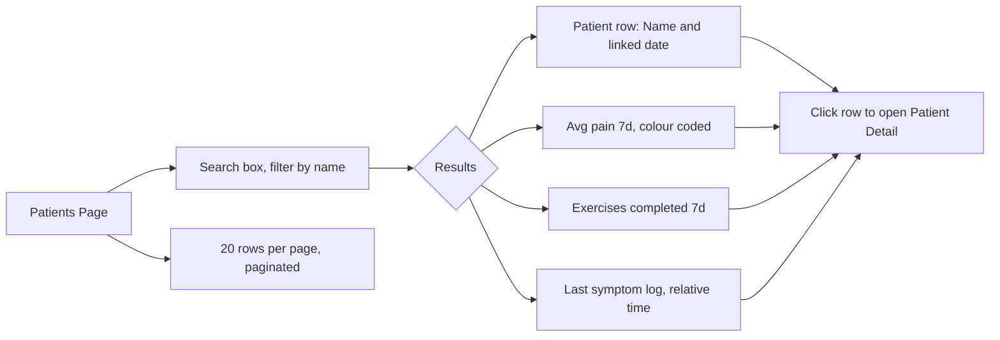

### Columns

| Column         | Description                                           |
|----------------|-------------------------------------------------------|
| Avatar + Name  | Circle with initials. Full name below. Linked date.   |
| Pain (7d avg)  | Red ≥7, orange ≥4, grey <4                            |
| Exercises (7d) | Count of exercise completions in past 7 days          |
| Last Log       | Relative time since last symptom entry                |
| →              | Arrow link indicator                                  |

### Generating a Linking Code from the Patient List

There is a **Generate linking code** button at the top right of the Patients page. See [Section 13](#13-linking--connecting-new-patients) for the full linking flow.

---

## 8. Patient Detail View

### Navigating (`/patients/:patientId`)

Click any row in the Patients table.

### Layout

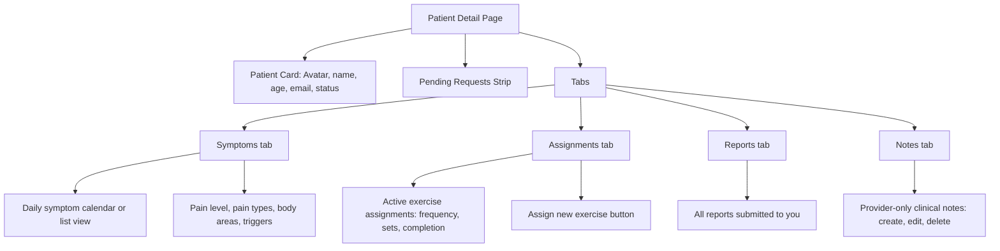

### Patient Card

- **Avatar** with coloured status border (green = active, grey = inactive)
- **Name**, **age** (calculated from date of birth if provided), **email**
- **Active status** indicator
- **Assign exercise** button — opens the assignment drawer

### Symptoms Tab

Shows a **chronological list** of symptom log entries submitted by this patient.

Each entry contains:
- Date & time logged
- Pain level (0–10)
- Pain types (e.g., "aching", "throbbing")
- Body areas affected (e.g., `jaw — left`, `temple — left`)
- Duration in minutes
- Triggers (e.g., "chewing", "stress")
- Patient notes (free text)

> You can only see symptoms for patients who are **actively linked** to you. If a patient disconnects, their historical data is no longer accessible.

### Assignments Tab

Shows all current exercise assignments for this patient. See [Section 10](#10-assigning-exercises-to-patients) for full details.

### Reports Tab

Shows all reports this patient has submitted specifically to you. Click any row to go to the Report Detail page.

### Notes Tab

Provider-only clinical notes — these are **never visible to the patient**.

- Click **Add note** to create a new note.
- Click the **edit icon** on an existing note to modify it.
- Click the **delete icon** to remove a note (confirmation required).

---

## 9. Exercise Library

### Navigating (`/exercises`)

Click **Exercises** in the sidebar.

### Library Overview

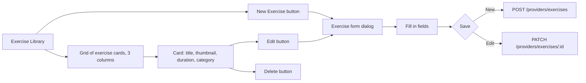

### Creating a New Exercise

1. Click **New exercise**.
2. Fill in the exercise form:

| Field        | Required | Notes                                                           |
|--------------|----------|-----------------------------------------------------------------|
| Title        | Yes      | Short descriptive name                                          |
| Description  | No       | Brief overview. HTML is stripped — use plain text.              |
| Instructions | No       | Step-by-step instructions. Plain text. E.g. "1. Open mouth slightly\n2. Move jaw left..." |
| Duration     | No       | Expected duration in seconds (e.g. 120 for 2 minutes)          |
| Category     | No       | e.g. `Stretching`, `Strengthening`, `Posture`, `Relaxation`     |
| Video URL    | No       | Link to an uploaded video (from the Upload endpoint)            |
| Thumbnail    | No       | Thumbnail image URL                                             |

3. Click **Save exercise**.

### Uploading an Exercise Video

1. On the exercise form, click **Upload video**.
2. Select an `.mp4` or `.mov` file (max 100 MB).
3. Wait for the upload to complete — the video URL is filled in automatically.

> The MIME type is validated server-side by inspecting the file's magic bytes (not just the extension).

### Editing an Exercise

Click the **edit icon** on any exercise card. The same form dialog opens pre-filled. Make changes and click **Save exercise**.

### Deleting an Exercise

1. Click the **delete icon** on any exercise card.
2. A confirmation prompt appears: "Deleting this exercise will remove all assignments linked to it."
3. Click **Delete**.

> ⚠️ **Cascading deletion:** All exercise assignments linked to this exercise are also deleted from every patient.

### Empty State

If you have no exercises yet, the page shows:
> "An empty library. Start with the first exercise — record a short demonstration and write a few lines about the movement."

Click **Create your first exercise** to begin.

---

## 10. Assigning Exercises to Patients

### Assigning from the Patient Detail Page

1. Navigate to a patient's detail page (`/patients/:patientId`).
2. Click the **Assign exercise** button in the patient card, or click the **Assign new exercise** button in the Assignments tab.
3. An assignment drawer opens.

### Assignment Flow

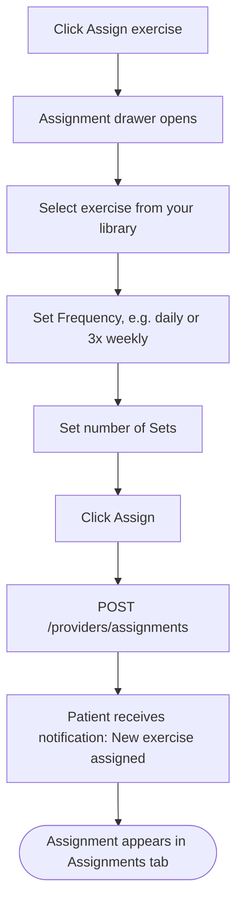

### Form Fields

| Field     | Options / Notes                                               |
|-----------|---------------------------------------------------------------|
| Exercise  | Dropdown of your library                                      |
| Frequency | Free text e.g. `daily`, `3x weekly`, `twice daily`            |
| Sets      | Number (default 1)                                            |

### Updating an Assignment

In the Assignments tab, each row has an action menu:

| Action         | What It Does                                              |
|----------------|-----------------------------------------------------------|
| Edit           | Change frequency or sets                                  |
| Pause          | Sets status to `paused` — patient still sees it but it is greyed out |
| Resume         | Sets status back to `active`                              |
| Mark complete  | Sets status to `completed` — historical record kept       |
| Remove         | Deletes the assignment (confirmation required)            |

### Monitoring Completion

Each assignment row in the Assignments tab shows:
- **Completion rate** — percentage of days the patient completed the exercise (last 7 days)
- **Last completed** — relative time of the most recent completion

---

## 11. Report Inbox

### Navigating (`/reports`)

Click **Reports** in the sidebar.

### Inbox Overview

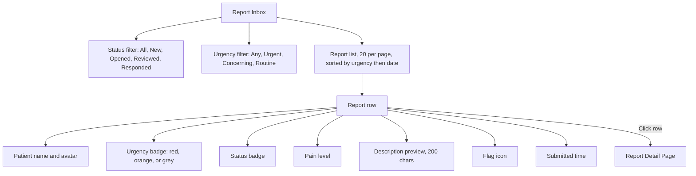

### Sort Order

Reports are **always sorted by urgency first (highest first), then by submission date (newest first)**. You cannot change this sort order — it is designed to surface critical reports at the top.

### Status Flow

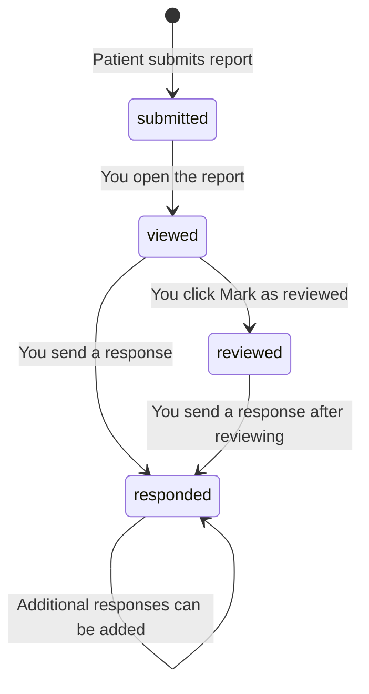

### Urgency Levels

| Level       | Badge Colour | When used                                               |
|-------------|-------------|---------------------------------------------------------|
| Urgent      | Red         | Severe pain, emergency symptom, cannot eat/open jaw     |
| Concerning  | Orange      | Elevated pain, worsening trend, needs prompt attention  |
| Routine     | Grey        | Regular check-in, stable or improving condition         |

### Flagged Reports

The **flag** icon on a report is a provider-side bookmark. Use it to mark reports that need follow-up action. Flagging does not affect the status or notify the patient.

To toggle: click the flag icon in the report table row or on the report detail page.

---

## 12. Responding to a Report

### Opening a Report

Click any row in the Report Inbox to go to the Report Detail page (`/reports/:reportId`).

### Report Detail Layout

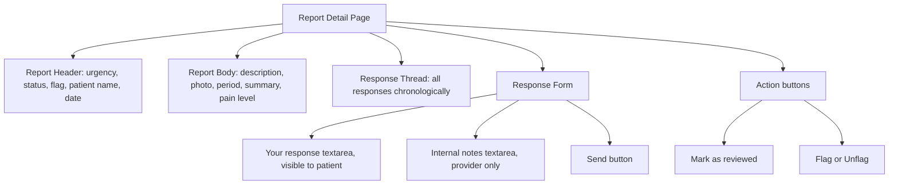

### Sending a Response

1. Scroll to the **response form** at the bottom of the report.
2. Write your **response to the patient** in the first textarea. This message will be visible to the patient in their patient app.
3. *(Optional)* Write **internal notes** in the second textarea. These are **never shown to the patient** and are only visible to you.
4. Click **Send**.

> Multiple responses per report are allowed. Each appears in the response thread with a timestamp. The patient sees all of them in order.

### Marking as Reviewed

Click **Mark as reviewed** if you have read and acted on the report but do not need to send a textual response. This changes the status to `reviewed` and records a `reviewed_at` timestamp.

### Report Body Fields

| Field          | Description                                                     |
|----------------|-----------------------------------------------------------------|
| Description    | Patient's narrative of their current symptoms                   |
| Photo          | If the patient attached a photo, it is shown here               |
| Period         | The time range this report covers (e.g., "15 Mar – 20 Mar")     |
| Summary data   | Auto-calculated: 7-day avg pain, symptom log count, exercises completed |
| Pain level     | 0–10 scale                                                      |
| Patient notes  | Additional free-text notes the patient added                    |

### Response Thread

All previous responses (yours and previous ones) are shown **above** the response form in chronological order. Internal notes are shown only to you.

---

## 13. Linking — Connecting New Patients

Patients must be linked to you before they can submit reports or receive exercise assignments. Linking is initiated by you (the provider) via a 6-character invite code.

### Full Linking Flow

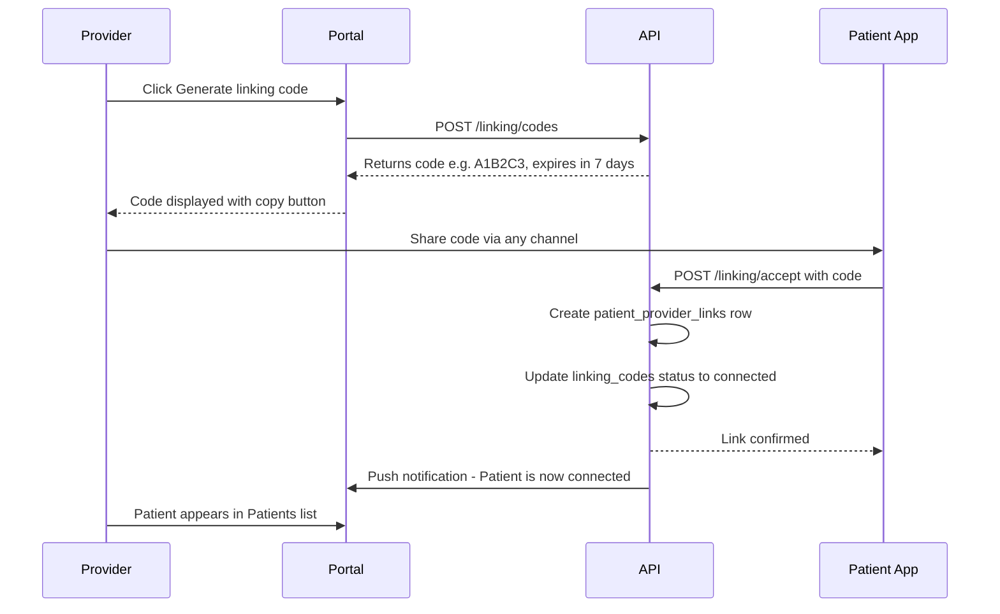

### Navigating (`/linking`)

Click **Linking** in the sidebar.

### Generating a Code

1. Click **Generate linking code**.
2. A dialog displays the 6-character code (e.g., `A1B2C3`).
3. Click the **copy icon** to copy the code to your clipboard.
4. Share the code with your patient by:
   - Telling them verbally
   - Sending it via SMS or your preferred communication channel
   - Using the **Email invite** feature (see below)

Codes expire after **7 days**. After expiry the code can no longer be used by a patient.

### Sending an Email Invite

1. Navigate to **Linking**.
2. In the **pending codes table**, find the code you want to send.
3. Click **Send invite** next to that code.
4. Enter the patient's email address.
5. Click **Send** — a pre-formatted invitation email is sent to the patient.

### Code Status

| Status      | Meaning                                                                   |
|-------------|---------------------------------------------------------------------------|
| `pending`   | Generated but not yet accepted by any patient                             |
| `connected` | A patient accepted the code — they are now linked to you                  |
| `expired`   | The 7-day window passed without the patient accepting                     |

### Active Links Table

The **Active links** table shows all patients currently linked to you.

| Column        | Description                                          |
|---------------|------------------------------------------------------|
| Patient name  | Full name and email                                  |
| Linked date   | When the patient accepted the invite                 |
| Last active   | Patient's last login relative time                   |
| Action        | **Disconnect** button                                |

### Disconnecting a Patient

1. Find the patient in the **Active links** table.
2. Click **Disconnect**.
3. A confirmation dialog: "Disconnecting will remove access to this patient's data. Are you sure?"
4. Click **Disconnect**.

> Disconnecting is a **soft delete** — the `unlinked_at` timestamp is set. Historical reports and symptom data are no longer accessible after disconnection. The patient can be re-linked in the future by generating a new code.

---

## 14. Notifications

### Notification Bell

A bell icon in the top navigation header shows the **count of unread notifications**. It polls for new notifications every 30 seconds.

### Navigating (`/notifications`)

Click the bell or click **Notifications** if shown in the sidebar.

### Notification List

- **All** or **Unread** filter toggle at the top
- Sorted newest first
- Click **Mark as read** on any notification to clear it from the unread count

### Notification Types

| Type               | When triggered                                                                 |
|--------------------|--------------------------------------------------------------------------------|
| `report_submitted`  | A linked patient submits a new report to you                                  |
| `report_urgent`     | A linked patient submits an urgent report (also triggers SMS if your preferences allow) |
| `link_accepted`     | A patient accepted your invite code and is now linked                         |
| `streak_milestone`  | A patient reaches an exercise or symptom logging streak milestone              |

### Notification Preferences

Navigate to **Notifications → Preferences** or **Settings → Notifications**.

| Channel               | Default  | Description                                             |
|-----------------------|----------|---------------------------------------------------------|
| Exercise reminders    | On       | Push notification when exercise schedules change        |
| Symptom check-in      | On       | Push when patients log symptoms                         |
| Provider messages     | On       | Push and email for patient messages and urgent reports  |
| Report updates        | On       | Push and email when report statuses change              |
| Email digest          | Instant  | Instant / Daily / Weekly / Off                          |

---

## 15. Account Settings

### Navigating (`/settings`)

Click **Settings** in the sidebar.

### Profile Section

Update your personal and professional details:

| Field          | Notes                                                                     |
|----------------|---------------------------------------------------------------------------|
| Avatar         | Click to upload. Max 5 MB. JPEG or PNG only. Preview before save.         |
| First Name     | Editable                                                                  |
| Last Name      | Editable                                                                  |
| City           | Editable                                                                  |
| State          | Editable                                                                  |
| Timezone       | IANA timezone dropdown                                                    |
| License Number | Your professional license reference                                       |
| License Type   | e.g. `DDS`, `PT`, `DMD`                                                   |
| Specialty      | e.g. `Orofacial Pain`                                                     |
| Clinic Name    | Your practice name                                                        |
| Credentials    | Comma-separated array of titles. Click + to add, × to remove.             |

Click **Save** to persist changes.

### Password Change

See [Section 17 — Password Management](#17-password-management).

---

## 16. Active Sessions & Security

### Navigating (`/settings/sessions`)

From Settings, go to the **Sessions** section.

### Session Table

Each row represents an active login on a specific device:

| Column       | Description                                     |
|--------------|-------------------------------------------------|
| Device       | User-agent string (browser and OS)              |
| IP Address   | IP from which the session was started           |
| Last Active  | Relative time of last API request               |
| Initiated    | Date the session was created (i.e., login date) |

### Terminating a Session

1. Find the session you want to close.
2. Click **Revoke**.
3. Confirmation: "This will log out that device. Continue?"
4. Click **Confirm**.

> Revoking a session on another device forces an immediate re-login on that device at their next API request.

### Revoking All Other Sessions

Click **Revoke all other sessions** to terminate every session except your current one. This is useful if you suspect your account may be accessed from an unrecognised device.

---

## 17. Password Management

### Changing Your Password

While logged in:

1. Go to **Settings**.
2. Click **Change password**.
3. Fill in the form:
   - **Current password** (required for verification)
   - **New password** (min 8 characters, at least 1 digit and 1 special character)
   - **Confirm new password** (must match)
4. Click **Save**.

### Resetting a Forgotten Password

If you cannot log in:

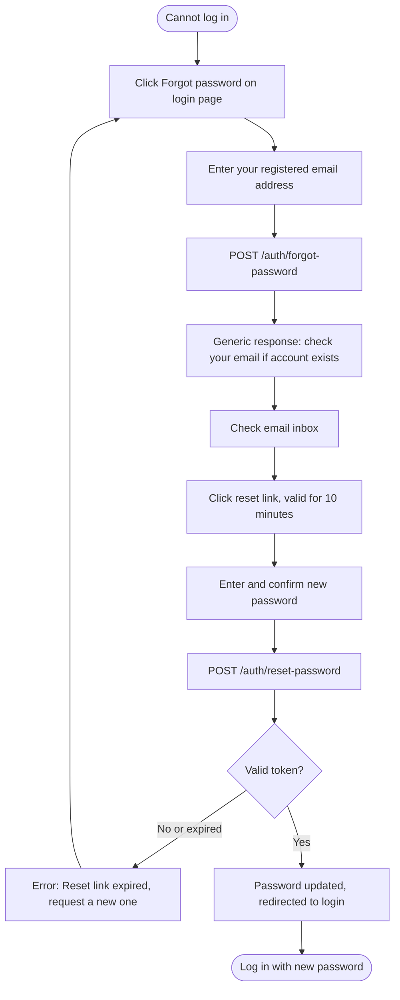

> Password reset tokens expire after **10 minutes**. If yours expires, repeat the forgot-password flow.

---

## 18. Error Reference

### Authentication & Access Errors

| Error Code            | What it means                                         | What to do                                                 |
|-----------------------|-------------------------------------------------------|------------------------------------------------------------|
| `UNAUTHORIZED`        | Your token is missing or invalid                      | Log out and log back in                                    |
| `SESSION_TIMEOUT`     | Inactive for 15 minutes — session deleted             | Log in again                                               |
| `FORBIDDEN`           | You do not have permission                            | Check you are using a provider account                     |
| `MFA_REQUIRED`        | Login accepted but MFA step not yet completed         | Complete the MFA step                                      |
| `MFA_SETUP_REQUIRED`  | Account created but MFA never enrolled                | Complete MFA setup before continuing                       |
| `ACCOUNT_DEACTIVATED` | Account has been deactivated by an admin              | Contact your system administrator                          |

### Form & Data Errors

| Error Code         | What it means                                          | What to do                                       |
|--------------------|--------------------------------------------------------|--------------------------------------------------|
| `VALIDATION_ERROR` | A field did not pass server-side validation            | Read the inline field error message and correct it |
| `NOT_FOUND`        | The patient, report, or exercise no longer exists      | Refresh the page                                 |
| `CONFLICT`         | Duplicate — e.g., patient already linked               | Check the existing link in the Linking page      |

### Linking Errors

| Error                          | What it means                                                    |
|--------------------------------|------------------------------------------------------------------|
| Code not found                 | The patient entered an invalid or non-existent code              |
| Code expired                   | The 7-day window passed. Generate a new code and share it.       |
| Already connected              | The patient is already linked to you. No action needed.          |
| Patient already linked to code | A different patient has already claimed this code.               |

### Rate Limits

| Endpoint           | Limit                  | Reset  |
|--------------------|------------------------|--------|
| Login              | 5 attempts / 15 min    | Rolling|
| MFA verify         | 5 attempts / 15 min    | Rolling|
| Email verification | 3 resends / 1 hour     | Rolling|
| General API        | Per-IP configured limit| Rolling|

After hitting a rate limit you will see a `429 Too Many Requests` response. Wait for the reset window before retrying.
